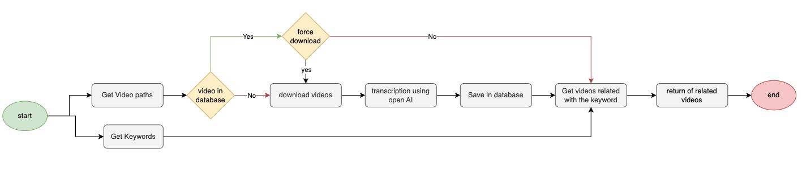

# 🎥 YouTube Video Transcription Pipeline

This repository provides an end-to-end pipeline for transcribing YouTube videos using OpenAI's Whisper API. The pipeline includes:

- ✅ Extracting audio from YouTube videos.
- ✅ Transcribing audio using OpenAI's API.
- ✅ Filtering transcriptions based on keywords.
- ✅ Orchestrating the workflow with Apache Airflow.
- ✅ Deploying on AWS Fargate or GCP Cloud Run for scalability.
- ✅ Storing transcriptions in a PostgreSQL database.
- ✅ Searching videos related to a given word using `ts_queries` in PostgreSQL.

---

## ✨ Features

- 🔹 **YouTube Audio Download**: Extracts audio from YouTube videos using `pytube`.
- 🔹 **OpenAI Transcription**: Uses OpenAI's Whisper API for accurate transcription.
- 🔹 **Keyword Filtering**: Searches transcriptions for specified keywords.
- 🔹 **Workflow Orchestration**: Managed by Apache Airflow for scheduling and monitoring.
- 🔹 **Cloud Deployment**: Runs on AWS Fargate or GCP Cloud Run for scalability and cost-efficiency.
- 🔹 **Database Storage**: Saves transcriptions in a PostgreSQL database for persistence and querying.
- 🔹 **Efficient Search**: Uses PostgreSQL `ts_queries` for full-text search on transcriptions.

---

## 🛠 Technologies Used

- 🚀 **Python** - Core programming language.
- 🎵 **pytube** - For downloading YouTube audio.
- 🧠 **OpenAI API** - For audio transcription.
- 🌀 **Apache Airflow** - For workflow orchestration.
- ☁️ **AWS Fargate / GCP Cloud Run** - Cloud deployment solutions.
- 🐳 **Docker** - For containerizing the application.
- 🗄 **PostgreSQL** - For storing and managing transcriptions.
- 🔍 **PostgreSQL ts_queries** - For efficient full-text search.

---

## ⚙️ How It Works

1. **Input**: Provide a list of YouTube video IDs and optional keywords.
2. **Audio Download**: The pipeline extracts audio from each video.
3. **Transcription**: OpenAI's Whisper API transcribes the audio.
4. **Keyword Filtering**: The transcriptions are scanned for the provided keywords.
5. **Storage**: Transcriptions are saved in a PostgreSQL database.
6. **Search**: Videos are retrieved based on keywords using `ts_queries` in PostgreSQL.
7. **Output**: A filtered list of videos with their corresponding transcriptions.

---


## Flow Diagram


## **Overview**  
The following SQL query performs a **full-text search** in a PostgreSQL database to find videos that contain specific keywords within their transcription text.  

```sql
SELECT video_id
FROM transcriptions.videos
WHERE to_tsvector('english', text) @@ to_tsquery('english', 'Kubernetes | container');
```